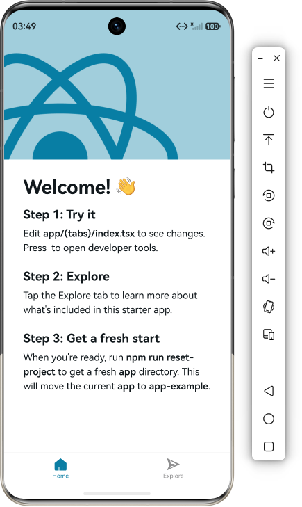

# expo-harmony-cli

使用 Expo SDK 创建 React Native 项目，并注入 HarmonyOS（OpenHarmony）开发基线的命令行工具。

<p align="center">
  <strong>用 Expo 工作流，一套 React Native 代码同时覆盖 HarmonyOS、iOS、Android 三端</strong>
</p>

<p align="center">
  <a href="https://www.npmjs.com/package/expo-harmony-cli"></a>
  <a href="https://www.npmjs.com/package/expo-harmony-cli"></a>
  <a href="https://github.com/stonehill-2345/expo-harmony-cli/blob/main/LICENSE"></a>
  <a href="https://github.com/stonehill-2345/expo-harmony-cli"></a>
</p>

## 这是什么？

**一句话**：`expo-harmony-cli` 是一个命令行工具，让你用 Expo SDK 创建项目，一键生成 HarmonyOS（OpenHarmony）原生工程，同一套 JS/TS 代码同时运行在鸿蒙、iOS、Android 上。

- 🎯 **问题**：React Native 生态缺乏标准化的鸿蒙开发工具链，手动配置鸿蒙原生工程繁琐且易出错
- ✅ **解决**：一条 `npx` 命令完成项目创建、鸿蒙工程生成、依赖管理、原生注册，沿用 Expo CNG（Continuous Native Generation）工作流

## 目录

- [快速开始](#快速开始)
- [核心能力](#核心能力)
- [效果预览](#效果预览)
- [环境与支持范围](#环境与支持范围)
- [与 Expo 标准工作流的关系](#与-expo-标准工作流的关系)
- [常见问题](#常见问题)
- [开发与贡献](#开发与贡献)
- [文档](#文档)
- [仓库与链接](#仓库与链接)

## 快速开始

### SDK54（推荐）

使用官方 `create-expo-app` 创建 fresh 项目，并通过 npm alias 安装 15 个已发布的 `@expo-oh` HarmonyOS 运行时包：

```bash
# 1. 创建 SDK54 项目（--template：default 含 Expo Router / blank-typescript；--pnpm 可换 --npm）
npx expo-harmony-cli@latest create my-app --sdk 54 --template default --pnpm

# 2. 生成 HarmonyOS 原生工程
cd my-app
npx expo prebuild --platform harmony

# 3. 构建、安装并启动到鸿蒙设备（原生代码或依赖变更后重新执行）
npx expo run:harmony

# 4. 日常开发：启动 Metro，JS 改动即时生效
npx expo start
```

clean Release 构建使用 `npx expo run:harmony --configuration Release --no-build-cache`。SDK54 的公开保证范围是 fresh `default` 和 `blank-typescript`：新项目不安装 `patch-package`，也不复制本地 patch；旧 SDK54 patch 项目不会自动迁移。

14 个 Expo 适配包和 `@expo-oh/react-native-screens` 已使用 `harmony` dist-tag 发布。项目仍保留 `expo`、`expo-router`、`@expo/cli` 等原始依赖键和 import，实际包通过 alias 解析到 `@expo-oh/*`。产品 CLI 继续使用无 scope 包名 `expo-harmony-cli`，不属于这 15 个运行时包的发布集合。

### SDK52（legacy）

SDK52 的 creator、injector、scanner、cleanup、依赖管理和 Harmony generator 保持原有 legacy 流程：

```bash
# 1. 创建 SDK52 项目
npx expo-harmony-cli@latest my-harmony-app --sdk 52

# 2. 安装 JS 依赖并应用 HarmonyOS patch
cd my-harmony-app
pnpm install

# 3. 首次生成 HarmonyOS 原生工程
npx expo-harmony-cli prebuild --platform harmony

# 4. 安装 ArkTS / HAR 原生依赖
cd harmony
ohpm install

# 5. 回到项目根目录，启动 HarmonyOS Metro
cd ..
pnpm start:harmony
```

随后在 DevEco Studio 中打开项目的 `harmony/` 目录，选择 `entry` 模块并运行到真机或模拟器。

## 核心能力

| 能力                | 说明                                                                                          |
| ------------------- | --------------------------------------------------------------------------------------------- |
| 🚀 **一键创建**     | `npx expo-harmony-cli <目录名> [--sdk=52\|54]` 创建 Expo 项目，自动注入 HarmonyOS 开发基线    |
| 🧬 **原生工程生成** | 生成 HarmonyOS 原生工程、Metro 配置、RNOH（React Native OpenHarmony）依赖和开发文档           |
| 📦 **依赖管理**     | SDK54 使用已发布的 `@expo-oh` 包；SDK52 继续由 CLI 管理 patch、alias 与原生注册               |
| 🔗 **智能原生注册** | 官方优先：优先调用 RNOH 官方 `link-harmony`，未覆盖由内置映射表补充，均未覆盖逐包提示适配指引 |
| 🩺 **环境诊断**     | 内置 `env` / `doctor` 命令，工具链检查 + 项目健康诊断，退出码分级可接入 CI                    |
| 🛡️ **文件保护**     | autolinking 托管文件被手动修改时阻断覆盖，事务写入失败自动回滚                                |
| ✅ **装后验证**     | SDK54 创建后校验实际包名、版本、运行入口和原生文件，失败即报错                               |
| 🔄 **Expo 兼容**    | 保留 Android、iOS 与 Web 的 Expo 标准工作流，不影响现有开发生态                               |

## 效果预览

<p align="center">
  
</p>

## 环境与支持范围

| 项                               | 要求 / 基线                               |
| -------------------------------- | ----------------------------------------- |
| Node.js                          | ≥ 20.19.4                                 |
| pnpm                             | ≥ 10.19.0                                 |
| DevEco Studio                    | 5.0+（含 OpenHarmony SDK、ohpm、hdc）     |
| Expo                             | SDK 52（Expo 52.x）或 SDK 54（Expo 54.x） |
| React Native                     | 0.77.x（SDK 52）或 0.82.x（SDK 54）       |
| RNOH（React Native OpenHarmony） | 0.77.x（SDK 52）或 0.82.x（SDK 54）       |
| iOS 构建                         | 遵循对应 Expo SDK 版本官方要求            |

## 与 Expo 标准工作流的关系

`expo-harmony-cli` **不是 Expo 的替代品**，而是 Expo 的 HarmonyOS 扩展层：

- ✅ 沿用 Expo CNG（配置驱动、随时重建原生工程）工作流
- ✅ `expo run:android` / `expo run:ios` 照常使用
- ✅ 鸿蒙 Metro 与 Android/iOS 统一使用 8081 端口
- ✅ 鸿蒙构建通过 DevEco Studio 完成，CLI 负责工程生成与依赖同步

本质上，你在 Expo 项目里多了一个 `--platform harmony` 选项，其他一切不变。

## 常见问题

### 为什么需要这个工具？直接用 Expo 不行吗？

Expo 官方目前不支持 HarmonyOS 平台。`expo-harmony-cli` 在 Expo SDK 基础上，通过 RNOH（React Native OpenHarmony）桥接层，让同一套 React Native 代码能运行在鸿蒙设备上。

### 支持哪些 React Native 库？

CLI 对依赖分五类自动处理：纯 JS 包、alias-only、native/bump-native、patch-only、unsupported。以 `pnpm dlx expo-harmony-cli list` 输出为准。详见 [使用指南 → 三方依赖](apps/cli/docs/guide.md#三方依赖)。

### 旧 SDK54 项目可以直接升级吗？

不自动升级。当前版本只对旧 SDK54 项目做只读诊断，推荐使用同模板 fresh create 新项目后迁移业务代码、资源和应用配置。

### 和 [react-native-harmony](https://github.com/react-native-oh-library/react-native-harmony) 是什么关系？

`expo-harmony-cli` 底层依赖 RNOH 作为鸿蒙桥接层，在此基础上封装了 Expo CNG 工作流、自动化依赖管理、原生注册。直接用 RNOH 裸 SDK 需手动完成所有原生工程配置；本工具把这些自动化了。

> 更多排障问题（依赖安装、构建失败、bundle 加载等）见 [使用指南 → 常见问题](apps/cli/docs/guide.md#常见问题)。

## 开发与贡献

使用 Node.js ≥ 20.19.4、pnpm 10.19.0，在仓库根目录执行：

```bash
pnpm install --frozen-lockfile
pnpm check
```

`pnpm check` 是 CI 同入口：类型检查 → 源码测试 → 打包产物测试 → SDK54 工具链校验（目录校验、打包确定性、归档审计、patch 审计、仓库检查）。

常用命令：

| 命令               | 用途                                                    |
| ------------------ | ------------------------------------------------------- |
| `pnpm test`        | 源码测试，不需要先构建                                  |
| `pnpm test:pack`   | 在临时目录构建、打包并验证实际安装包                    |
| `pnpm type-check`  | TypeScript 类型检查                                     |
| `pnpm build`       | 生成本地调试用的 `apps/cli/dist`                        |
| `pnpm pack:cli`    | 自动清理、构建并生成 CLI 安装包                         |
| `pnpm sdk54:check` | SDK54 工具链全套校验（目录 / 打包确定性 / 审计 / 仓库） |

运行本地 CLI：

```bash
pnpm build
pnpm --dir apps/cli exec node dist/index.js --help
```

模板、补丁和文档随 CLI 发布，使用方无需获取整个 monorepo。贡献流程见 [CONTRIBUTING.md](CONTRIBUTING.md)。

## 文档

- [CLI 使用指南](apps/cli/docs/guide.md)（SDK52 legacy 流程）
- [CLI 更新日志](apps/cli/CHANGELOG.md)
- [设计文档与验收证据](docs/)
- [SDK54 @expo-oh 发布计划](docs/plans/2026-10-09-sdk54-expo-oh-npm-release.md)
- [贡献指南](CONTRIBUTING.md) · [安全策略](SECURITY.md) · [行为准则](CODE_OF_CONDUCT.md)
- [第三方声明](NOTICE.md)

## 仓库与链接

- npm：[expo-harmony-cli](https://www.npmjs.com/package/expo-harmony-cli)
- GitHub：[stonehill-2345/expo-harmony-cli](https://github.com/stonehill-2345/expo-harmony-cli)
- Gitee：[stonehill-2345/expo-harmony-cli](https://gitee.com/stonehill-2345/expo-harmony-cli)
- AtomGit：[stonehill-2345/expo-harmony-cli](https://atomgit.com/stonehill-2345/expo-harmony-cli)

## 社区与支持

- 使用问题或功能建议：[GitHub Issues](https://github.com/stonehill-2345/expo-harmony-cli/issues)
- 想参与贡献：见[贡献指南](CONTRIBUTING.md)
- 如果这个项目帮到了你，随手点个 ⭐ Star 就是最好的支持——也能让更多做鸿蒙 React Native 开发的朋友找到它

## License

MIT
